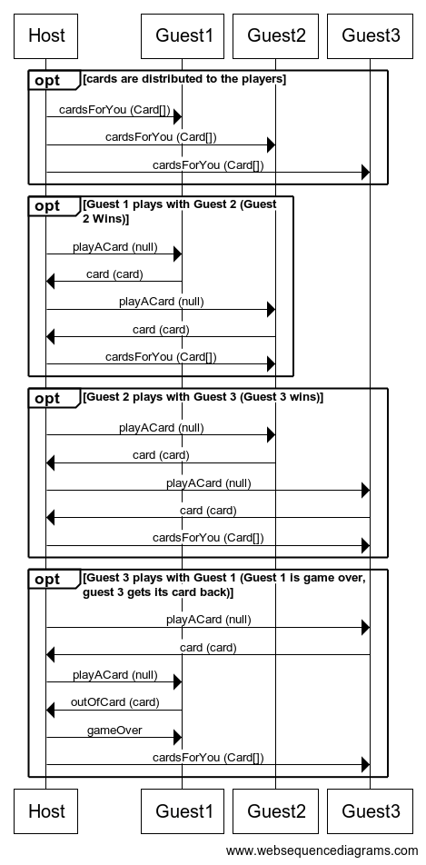

# Règles

Le jeu se joue à au moins deux joueurs et au max 10 joueurs et comporte un maitre du jeu non joueur.

## Mise en place

Chaque joueur reçoit 7 cartes tirées aléatoirement.

## Déroulé de la partie

Les joueurs sont répartis dans l'ordre d'arrivée.
La manche est finie lorsqu’un joueur a posé sa dernière carte.
Les points sont comptés à la fin de chaque manche.
Si à l’issue de la manche aucun joueur n’a atteint (voire #fin de la partie ) points, les cartes sont battues et redonner à la piohce et les joueurs commencent une nouvelle manche.
Si la PIOCHE est épuisée avant la fin d’une manche, le TALON est mélangé et le jeu continue.

### Déroulé d'une manche

Les joueurs doivent recouvrir la carte visible du TALON (pile) par une carte :
de même couleur,
ou portant le même numéro
ou le même symbole que celle-ci ou bien carte JOKER ou +4.
Si un joueur pose +4, +2 ou interdit le joueur d'apres ne jouera pas et piochera +2 ou +4 ou rien selon symbole de la carte.
En début de partie, la carte poser sur le haut du talon (pile) ne doit pas être une carte spécial c'est à dire avec un symbole.

## Fin de la partie

Le gagnant est le premier joueur à avoir atteint 250 points pour la partie local et 100 points partie Network .

### Détail des classes principales

Un exemple de jeu supportant le réseau

* LocalUno la version du jeu supportant le jeu en local
* UnoEngine le moteur du jeu
* UnoNetorkPlayer le joueur distant en cas de partie réseau
* UnoNetworkEngine la version du jeu supportant le réseau

# Protocole réseau

> Le protocole réseau définit les séquences des commandes échangées entre les différentes parties prenantes. Il doit contenir, pour chaque commande, l'expéditeur, le destinataire, le nom de la commande et le contenu du corps de la commande.

